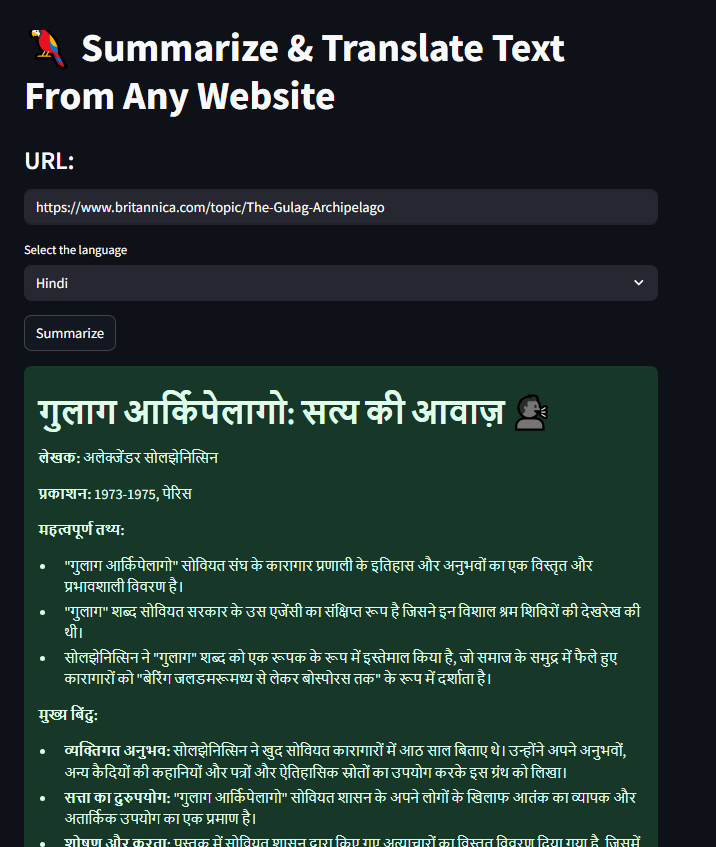

# 🦜 Summarize & Translate Text from Any Website 🌍

This is a **Streamlit web app** that takes a URL (e.g., blog, article, or Wikipedia page), fetches its text content, and generates a **beautiful, multi-language summary** using **Groq’s blazing-fast LLMs** via LangChain.

---

## 📸 App Preview




> *Summarize and translate website or Wikipedia content into your selected language*

---

## ✨ Features

- 🌐 **Summarize content** from any website (supports Wikipedia too)
- 🌍 **Translate summaries** into Hindi, Marathi, Tamil, Telugu, Kannada, or English
- ⚡ **Powered by Groq LLMs** (e.g., `gemma2-9b-it`)
- 📚 Uses LangChain's `load_summarize_chain`
- 🧠 Smart formatting: bullet points, emojis, structure
- 🛡️ Uses headers to mimic browser behavior and bypass some content blockers

---

## 🚀 How It Works

1. **Enter a URL** of a website or Wikipedia page
2. Select your **output language**
3. Click **"Summarize"**
4. The app fetches content, summarizes using an LLM, and displays it beautifully

---

## 🔑 Groq API Key (Required)

To run this app, you need a **free Groq API Key**.

👉 Sign up here: [https://console.groq.com](https://console.groq.com)  
Once logged in, go to **API Keys > Create Key** and copy it.

Paste the key in the sidebar of the app when prompted.

---

## 🛠️ Installation

1. **Clone the repository**

```
git clone https://github.com/G1Codes/Chat_Bots.git
cd Chat_Bots/Summarize_and_Translate
```

### ✅ Step 2: Install Python packages

```bash
pip install -r requirements.txt
```

### ✅ Step 3: Run the app

```bash
streamlit run Summarize_Translate.py
```

---

## 📁 Folder Structure

```
Text-Summarization/
├── README.md
├── app.py
├── requirements.txt
└── Screenshots/
    └── Eng_Summary.png
```

---

## ✅ Example URLs to Try

* 📘 Wikipedia: [https://en.wikipedia.org/wiki/Natural\_language\_processing](https://en.wikipedia.org/wiki/Natural_language_processing)
* 📰 Blog: [https://openai.com/blog/chatgpt](https://openai.com/blog/chatgpt)
* 🗞️ News: [https://edition.cnn.com/2023/06/01/tech/ai-writers-tools.html](https://edition.cnn.com/2023/06/01/tech/ai-writers-tools.html)

---

## 🧰 Tech Stack

| Tool                  | Purpose                             |
| --------------------- | ----------------------------------- |
| Streamlit             | Frontend Web App                    |
| LangChain             | LLM chains and summarization logic  |
| Groq                  | Inference for LLMs (`gemma2-9b-it`) |
| WikipediaLoader       | Load structured Wikipedia articles  |
| UnstructuredURLLoader | Scrape content from public sites    |

---

## ✅ Tips for Best Results

* Choose **clear, publicly accessible URLs**
* Avoid login-based pages (e.g., Medium paywall)
* Use Wikipedia for consistent structure and data
* Pick the correct language **before** summarizing

---

## 📜 License

This project is licensed under the **MIT License**.

---
